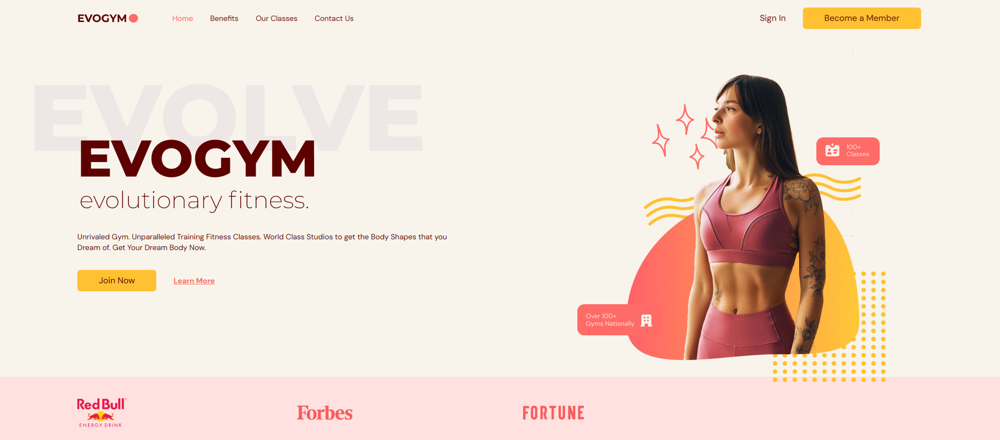

# EvoGym Fitness UI Mockup

This is a single-page UI mockup of a gym website. 

 

## Installation
- Fork this repository
- Clone your forked repository
- Open your forked repository on your local computer in your preferred code editor
- Navigate to the project directory
- To install dependencies, run `npm install`, `yarn install`, `pnpm install`, or `bun install` in the terminal
- To run the development server, run `npm run dev`, `yarn dev`, `pnpm dev`, or `bun dev` in the terminal

 

## Technologies
- [Typescript](https://www.typescriptlang.org/) 
- [React](https://react.dev) 
- [Tailwind CSS](https://tailwindcss.com/) 
- [Heroicons](https://heroicons.com/) 
- [FormSubmit](https://formsubmit.co/) 
- [Framer Motion](https://www.framer.com/motion/introduction/) 
- [`prettier-plugin-tailwindcss`](https://github.com/tailwindlabs/prettier-plugin-tailwindcss) 
- [`react-anchor-smooth-scroll`](https://github.com/mauricevancooten/react-anchor-link-smooth-scroll) 

 

## Credits
- This project was completed as practice in accordance with guidance provided by a 244-minute [YouTube tutorial](https://youtu.be/I2NNxr3WPDo) uploaded by [EdRoh](https://www.youtube.com/@EdRohDev) on the 21st of December 2022, titled “Build a Complete Typescript React Fitness Application for Beginners | Responsive”.
- The assets used in this project were sourced from [ed-roh's gym-typescript Github repository](https://github.com/ed-roh/gym-typescript).
- This project was bootstrapped with [Vite](https://github.com/vitejs/vite/tree/main/packages/create-vite).

